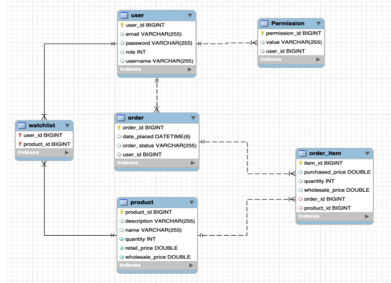

# SuperMart


## Overview
This backend component for the Shopping App is developed using Django and the Django REST framework. It serves as the RESTful API to support the frontend Angular application, providing endpoints for user registration, login, product management, order processing, and administrative tasks. The project follows a layered architecture and uses JWT for authentication.

## Database Design


## Features
**User (Buyer) Features**<br/>

Registration [POST]<br/>
Allows users to register with a unique username, email, and password.
Validates to prevent duplicate registrations.
Passwords are encrypted for security.

Login [POST]<br/>
Authenticates users and provides JWT tokens.
Custom exception handling for incorrect credentials.

Home Page [GET]<br/>
Displays all available products (excluding out-of-stock items).
Provides product details without revealing stock quantity.

Purchasing [POST, PATCH]<br/>
Allows users to place orders with multiple items.
Deducts item stock upon order placement.
Handles insufficient stock with custom exceptions.
Users can cancel orders to restore stock (excluding completed orders).

Product Watchlist [POST, DELETE, GET]<br/>
Users can add/remove products to/from their watchlist.
Displays only in-stock products in the watchlist.

Order Summary [GET]<br/>
Displays user's order history and details.
Shows top 3 most frequently and recently purchased items.

**Admin (Seller) Features**<br/>

Home Page [GET]<br/>
Displays a dashboard with order details, including user information and order status.
Shows listing information for current products.

Listing [POST]<br/>
Allows sellers to add new products with descriptions, wholesale price, retail price, and stock quantity.

Order Management [PATCH]<br/>
Enables sellers to update order status to Completed or Canceled.
Adjusts stock quantities based on order status changes.

Summary [GET]<br/>
Displays the most profitable product.
Shows the top 3 most popular products.
Provides total number of successfully sold items.

## Installation
**Clone the repository:**<br/>
```git clone https://github.com/your-repo/shopping-app-backend.git```

**Navigate to the project directory:**<br/>
```cd shopping-app-backend```

**Create and activate a virtual environment:**<br/>
```python -m venv env```<br/>
```source env/bin/activate```<br/>

**Install dependencies:** <br/>
```pip install -r requirements.txt```

**Create a superuser:**<br/>
```python manage.py createsuperuser```

**Start the development server:**<br/>
```python manage.py runserver```
